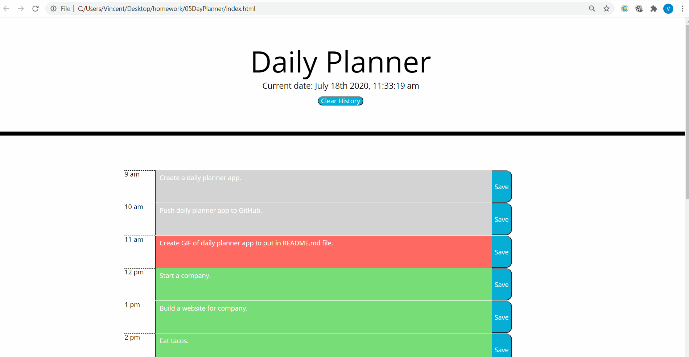

# 05DayPlanner
A day planner that have time blocks that change colors based on the time of day.

URL: https://vmcgargill.github.io/05DayPlanner/

## GetTime()
The get time function gets the current time every second and prints it out on the HTML page. This function has a timer interval set every 1 second so the time displayed on the screen updates every single second to make it look like a real clock.

## GenerateTimeBlocks()
The generate time block function creates a set of time blocks from each object from the timeblocks[] array and displays them on the screen. This function creates the row for each time block such as "9 am" adds a text area as well as it's own button used to save the text in the area. The function utilizes classes from the CSS style sheet to make the UI look nice. This function also assigns the save button with an index value and the text area with an index ID. This becomes important later when we create a onClick listener for all of our buttons so that we can match the buttons with their corresponding text areas in the same row.

## $(document).on('click','.saveBtn',function()
This particular function takes .saveBtn class and creates a function for each button element in that class. Each button has an index value that is the same as the ID of the corresponding textarea. It matches the button value with the textarea ID in order to locate which text area we are trying to save, then saves the textarea value by using localstorage.setItem and sets the item with the matching ID/save button value. That way if we click the button, it saves the value of the corresponding text area locally. However, this function only saves the teaxtarea value, it does not load the textarea value. So if we refresh the browser in this state, all of the text disapears. To load all of the textarea values, we are going to have to creat an additional function and call it the Get Stored Notes function.

## ClearHistory()
The clear history function searches through all of the description text areas by using a for toop, and removes the text in those areas. This gives the user the ability to quickly refresh their history if they have a bunch of notes on their they don't want. The function then clears the text areas, reloads the timeblocks, and then re-updates them to make it seemless to the end user

## GetStoredNotes()
The get stored notes function loads all of the stored notes that the user has saved for each time block. It accomplishes this by running a for loop that uses the localstorage.getItem function and checks all of the timeblocks[] indexes for any values stores. Then it inserts that text into their corresponding text areas based on the text area ID. This function loads when the page is loaded or refreshed so it loads the old notes every time.

## UpdateTimeBlocks()
The updtae timeblock function updates the colors of the time blocks based on weather the time block is in the past, present, or future. For example, if the current time is 10am, it will display the 9am block as gray, the 10am block as red, and the 11am block and all other future blocks as green. The function checks each active time block and uses anf if statement to see if that time block is in the past, present, or future. This is when Moment.js comes into play, it takes the format from the timeblock array and converts it into a time format, which can be used to compare with the current time the machine is on.

## TODO: Replace this gif in daytime.

- - -
© 2020 Vincent McGargill. All Rights Reserved.
